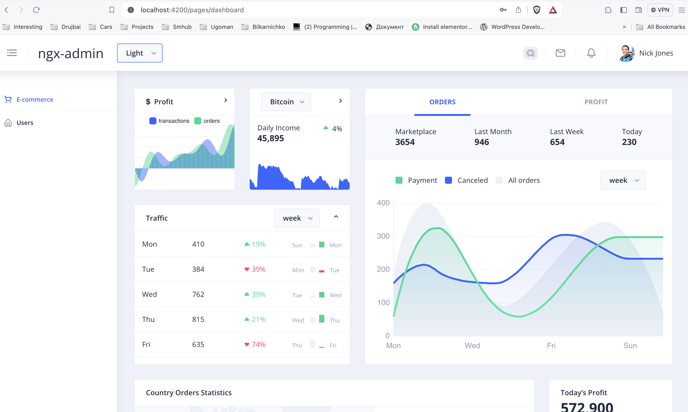

## Blueprint SQL

This project has one purpose -> startup project with all things configured, like: 

- Typescript
- Linting
- Github Hooks
- Testing
- Database connection
- Containerization
- Monitoring Tools
- Good Practices implemented

### Development

In order to be able to run the project you will need NodeJS and NPM installed.

Installation: https://nodejs.org/en/learn/getting-started/how-to-install-nodejs

Tips&Tricks: Install `nvm` (Node Version Manager)

#### BE

```shell
nvm install 14 && cd BE && npm i
```

#### ngx-admin

```shell
nvm install 16 && cd BE && npm i
```

