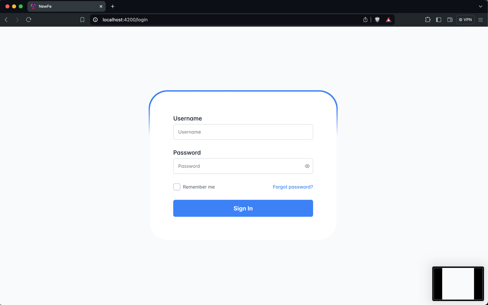
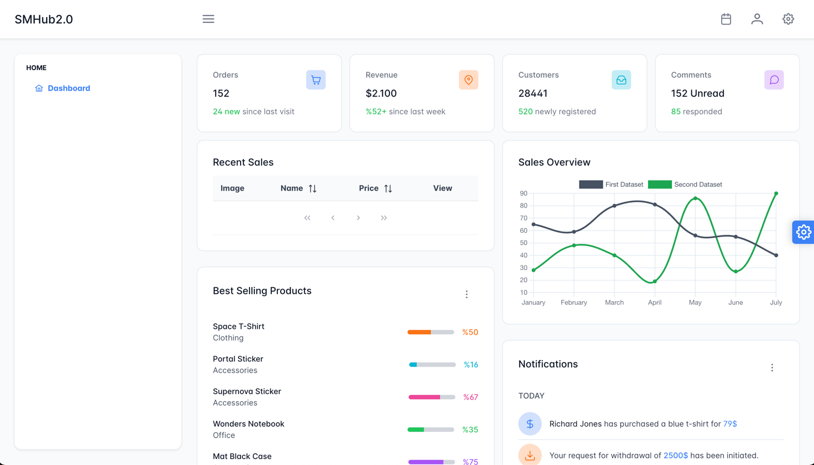

## Blueprint SQL

This project has one purpose -> startup project with all things configured, like: 

- Typescript
- Linting
- Github Hooks
- Testing
- Database connection
- Containerization
- Monitoring Tools
- Good Practices implemented





### Development

In order to be able to run the project you will need NodeJS and NPM installed.

Prerequisites: 
- Node & NPM - https://nodejs.org/en/learn/getting-started/how-to-install-nodejs
- Docker

Tips&Tricks: Install `nvm` (Node Version Manager)

#### BE

```shell
cd new-be && npm i
```

#### FE

```shell
cd new-fe && npm i
```

#### DB

The Database is Postgres and it is in Docker container 

```shell
docker-compose up
```

